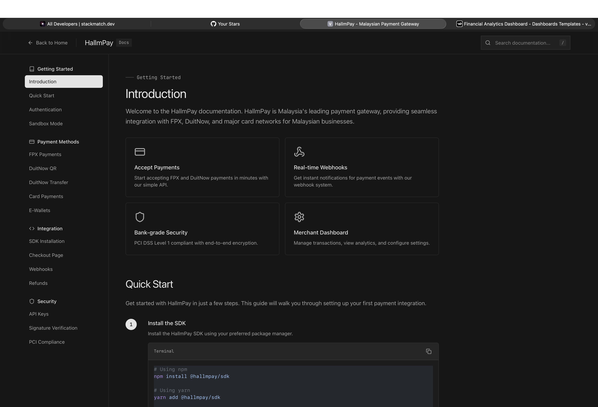
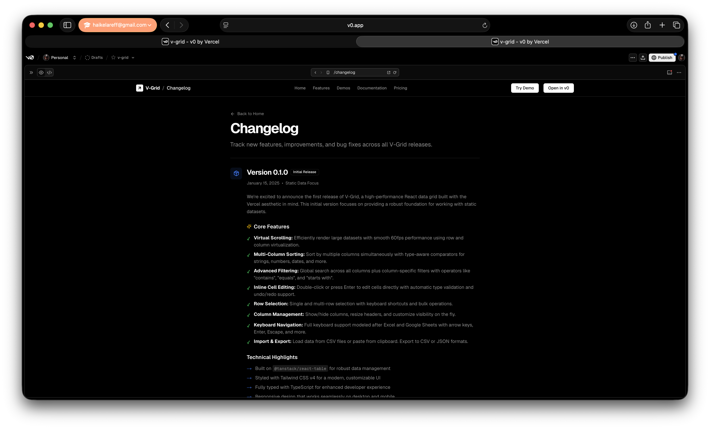

# HallmPay

HallmPay- Malaysian Payment Gateway 

## Overall structure

hallmpay/

├── apps
│   ├── api/src
│   ├── engine/src
│  
│
├── lib/src
│   ├── hallmpay-core/
│   ├── hallmpay-paynet/
│   ├── hallmpay-fpx/
│   ├── hallmpay-duitnow/
│   ├── hallmpay-jompay/
│   ├── hallmpay-db/
│   ├── hallmpay-auth/
│   ├── hallmpay-events/
│   └── hallmpay-openapi/
│
└── convex/
    ├── docker/
    ├── migrations/
    └── scripts/
    

    
## Todo 
    
[ ]	 For HallmPay, I would start with:
[ ]  Core Axum API (Client)
[ ]  PayNet authentication module
[ ]  FPX integration
[ ]  DuitNow Online Banking/Wallets
[ ]  Webhook handling
[ ]  Reconciliation worker
[ ]  JomPAY
[ ]  DuitNow QR
[ ]  Merchant onboarding
[ ]  Multi-tenant merchant accounts
